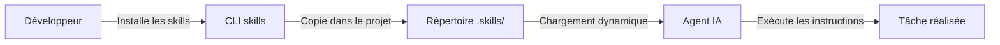

# Foundation Skills

Bibliothèque de skills IA pour les équipes Dedalus ERP-PAS. Chaque skill donne des instructions à votre assistant IA (Copilot, Claude Code, Cursor, Windsurf) pour accomplir des tâches de manière fiable et reproductible.

## Installation

```bash
# Installer tous les skills
npx skills add Dedalus-ERP-PAS/foundation-skills -g -y

# Mettre à jour
npx skills add Dedalus-ERP-PAS/foundation-skills -g -y --update
```

> **Prérequis :** Node.js 18+ et npm.
>
> **Guide complet :** [docs/comment-utiliser.md](docs/comment-utiliser.md)

## Comment ça fonctionne



## Skills disponibles

### Code et architecture

| Skill | Description | Doc |
|-------|-------------|-----|
| **coding-standards** | Conventions de nommage, principes SOLID, TypeScript/JavaScript | [doc](docs/coding-standards.md) |
| **backend-patterns** | Architecture backend : API RESTful, repository pattern, DB, caching | [doc](docs/backend-patterns.md) |
| **react-best-practices** | Best practices React/Next.js, shadcn/ui, React 19+ | [doc](docs/react-best-practices.md) |
| **vue-best-practices** | Best practices Vue.js 3/Nuxt, Composition API, PrimeVue | [doc](docs/vue-best-practices.md) |
| **typescript-migration** | Migration incrémentale JavaScript vers TypeScript | [doc](docs/typescript-migration.md) |

### Design system et UI

| Skill | Description | Doc |
|-------|-------------|-----|
| **design-compliance** | Audit de conformité au design system Hexagone avec auto-correction | [doc](docs/design-compliance.md) |

### Tests et qualité

| Skill | Description | Doc |
|-------|-------------|-----|
| **tdd** | Développement piloté par les tests (red-green-refactor) | [doc](docs/tdd.md) |
| **testing-patterns** | Patterns de test : unitaire, intégration, E2E, mocking | [doc](docs/testing-patterns.md) |
| **security-review** | Audit de sécurité et OWASP Top 10 | [doc](docs/security-review.md) |
| **git-guardrails** | Bloque les commandes git dangereuses (push --force, reset --hard) | [doc](docs/git-guardrails.md) |

### Revue et gestion de projet

| Skill | Description | Doc |
|-------|-------------|-----|
| **code-review** | Revue de code des merge requests GitLab | [doc](docs/code-review.md) |
| **issue-review** | Revue autonome d'issues par personas IA | [doc](docs/issue-review.md) |
| **triage-issue** | Investigation de bugs et création d'issues | [doc](docs/triage-issue.md) |
| **gitlab-issue** | Gestion des issues GitLab | [doc](docs/gitlab-issue.md) |
| **github-issues** | Gestion des issues GitHub | [doc](docs/github-issues.md) |
| **changelog-generator** | Changelogs automatiques depuis l'historique git | [doc](docs/changelog-generator.md) |

### Collaboration

| Skill | Description | Doc |
|-------|-------------|-----|
| **meeting** | Réunion simulée avec personas experts | [doc](docs/meeting.md) |
| **fast-meeting** | Réunion autonome rapide avec décision et MR/PR | [doc](docs/fast-meeting.md) |
| **grill-me** | Interview approfondie pour valider un plan | [doc](docs/grill-me.md) |
| **ubiquitous-language** | Extraction de glossaire DDD (domaine santé) | [doc](docs/ubiquitous-language.md) |

### Documents

| Skill | Description | Doc |
|-------|-------------|-----|
| **docx** | Documents Word (.docx) | [doc](docs/docx.md) |
| **xlsx** | Fichiers Excel (.xlsx) | [doc](docs/xlsx.md) |
| **pptx** | Présentations PowerPoint (.pptx) | [doc](docs/pptx.md) |
| **pdf** | Fichiers PDF | [doc](docs/pdf.md) |
| **article-extractor** | Extraction d'articles web | [doc](docs/article-extractor.md) |
| **docs** | Génération de README et documentation | [doc](docs/docs.md) |

### Hexagone et domaine santé

| Skill | Description | Doc |
|-------|-------------|-----|
| **hexagone-frontend** | Composants frontend Hexagone (@his/hexa-components) | [doc](docs/hexagone-frontend.md) |
| **hexagone-swdoc** | Web services Hexagone (endpoints, contrats) | [doc](docs/hexagone-swdoc.md) |
| **hexagone-web-feature-extractor** | Exploration d'un espace Hexagone Web en document PO | [doc](docs/hexagone-web-feature-extractor.md) |
| **hpk-parser** | Parsing des messages HPK propriétaires | [doc](docs/hpk-parser.md) |
| **hl7-pam-parser** | Parsing des messages HL7 v2.5 IHE PAM | [doc](docs/hl7-pam-parser.md) |
| **uniface-procscript** | Référence ProcScript pour Uniface 9.7 | [doc](docs/uniface-procscript.md) |

### Outils

| Skill | Description | Doc |
|-------|-------------|-----|
| **playwright-skill** | Automatisation navigateur et tests web | [doc](docs/playwright-skill.md) |
| **postgres** | Requêtes SQL lecture seule sur PostgreSQL | [doc](docs/postgres.md) |
| **mcp-builder** | Création de serveurs MCP | [doc](docs/mcp-builder.md) |
| **setup** | Installation des outils CLI, auth GitHub/GitLab, config Jira MCP | [doc](docs/setup.md) |
| **write-a-skill** | Guide pour créer un nouveau skill | [doc](docs/write-a-skill.md) |

## Ressources

- [Guide complet d'utilisation](docs/comment-utiliser.md)
- [Index documentation](docs/README.md)
- [Agent Skills](https://agentskills.io) — Standard ouvert
- [skills CLI](https://github.com/vercel-labs/agent-skills)

## Licence

MIT
