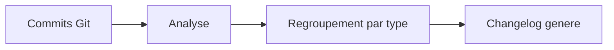

# Changelog Generator

Generation automatique de changelogs a partir de l'historique Git.

## Contexte

Rediger manuellement des notes de version est fastidieux et source d'oublis. Ce skill analyse les commits Git et genere un changelog structure automatiquement.

## Utilisation

Demandez simplement :

- `Cree un changelog depuis le dernier release`
- `Genere les notes de version pour les commits de la semaine`

## Fonctionnement

Le skill s'appuie sur la convention **Conventional Commits** (messages de commit structures du type `feat:`, `fix:`, `docs:`). Il regroupe les commits par categorie pour produire un document lisible.

Le changelog regroupe les commits en categories : nouvelles fonctionnalites, corrections, et autres changements.

## Fonctionnalites

- **Analyse des commits** Git depuis un tag ou une date
- **Generation automatique** de notes de version
- **Support Conventional Commits** — regroupe par `feat`, `fix`, `docs`, etc.
