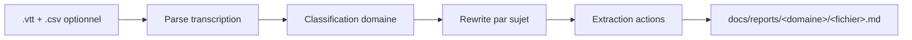

# Meeting Report

Génération automatique de comptes-rendus de réunion en français à partir d'une transcription Microsoft Teams.

## Contexte

Rédiger un compte-rendu de réunion prend du temps : écouter ou relire la transcription, réorganiser les échanges par sujet, extraire les décisions, identifier les actions à mener. Ce skill automatise toute la chaîne à partir du fichier `.vtt` exporté depuis Teams, avec en option le rapport de présence `.csv`.

**Spécifique au projet hexagone-monorepo.** Le compte-rendu est rangé automatiquement dans le bon sous-dossier de `docs/reports/` selon le domaine concerné.

## Utilisation

Déposer un ou deux chemins de fichiers dans le prompt :

```
crée un compte-rendu de cette transcription Teams /chemin/vers/reunion.vtt
génère le compte-rendu /chemin/vers/reunion.vtt /chemin/vers/attendees.csv
transforme cette transcription en rapport /chemin/vers/reunion.vtt
```

Le skill détecte les fichiers automatiquement grâce à leur extension (`.vtt` = transcription, `.csv` = présence).

## Fonctionnement



## Domaines supportés

Le skill classe automatiquement le compte-rendu dans le bon sous-dossier de `docs/reports/` :

| Dossier | Contenu |
|---|---|
| `foundation/` | Réunions internes de l'équipe Foundation (sprint, rétro, point équipe, daily) |
| `core/` | Sujets transversaux, architecture, LDAP, S3A, permissions, rôles |
| `gap/` | Gestion Administrative Patient : admission, venue, séjour, facturation, portail patient, ROC, serveur d'actes, urgences, Diapason |
| `grh/` | Ressources humaines : MyRHConnect, RH Dossier, paie, contrats |
| `gef/` | Finance et achats : pharmacie, M21, contentieux, trésorerie, HA GHT, immobilisations |
| `ui-ux/` | Design, maquettes, ateliers UX/UI, Figma, écrans, prototypes |

Si la réunion couvre plusieurs domaines, le skill choisit le domaine **dominant** (celui avec le plus de signaux dans la transcription).

## Convention de nommage

- **Réunions Foundation** : `YYYY-MM-DD.md` (date seule — une réunion d'équipe par jour au maximum)
- **Autres domaines** : `YYYY-MM-DD-<slug>.md` (slug généré à partir du sujet détecté)

Le nom de fichier utilise toujours le format ISO `YYYY-MM-DD`, tandis que la date dans le corps du compte-rendu est au format français `DD/MM/YYYY`.

## Format du compte-rendu

Le compte-rendu respecte exactement la structure existante des rapports hexagone-monorepo :

- **Titre** : `# Compte-rendu — <Type> <Sujet>`
- **Métadonnées** : date (`DD/MM/YYYY`), organisateur identifié
- **Participants** : liste simple séparée par des virgules
- **Sections numérotées** par sujet, chacune avec `### Décisions` et, si pertinent, `### Point d'attention` et `### Problèmes identifiés`
- **Table `## Actions`** à la fin du document (toujours présente, avec une ligne « Aucune action identifiée » si rien n'a été repéré)
- **Diagrammes Mermaid** optionnels, uniquement si le contenu les rend utiles (workflows multi-étapes, arbres de décision)

Pas de front-matter YAML, pas de métadonnées cachées.

## Rewrite intelligent

Le skill ne recopie pas la transcription — il la **réorganise par sujet** et en extrait les décisions :

- **Accents corrigés** : les transcriptions `.vtt` Teams en français sont régulièrement incomplètes sur les accents
- **Filler supprimé** : « euh », « du coup », « en fait », répétitions, hésitations
- **Ton professionnel** en français, utilisation de « nous » ou de la voie impersonnelle
- **Emphase `**gras**`** sur les termes-clés dans les décisions
- **Longueur cible** : 800 à 1500 mots par compte-rendu

## Gestion des participants

Ordre de priorité pour identifier les participants :

1. **Fichier `.csv` de présence Teams** — le skill extrait la colonne `Name`
2. **Balises `<v Speaker Name>` dans le `.vtt`** — lecture des tags de voix si présents
3. **Demande à l'utilisateur** — si la transcription est anonyme et qu'aucun fichier de présence n'est fourni, le skill s'arrête et demande la liste des participants avant d'écrire

Le skill n'invente jamais de noms.

## Comportement

- Écrit le fichier directement dans `docs/reports/<domaine>/<fichier>.md`
- **Ne commite pas** et ne pousse pas — la revue et le commit restent manuels
- **N'écrase jamais** un compte-rendu existant ; si un fichier avec le même nom existe déjà, un suffixe numérique (`-2`, `-3`) est ajouté
- **Pas de censure** — les réunions sont considérées comme internes et sûres, les noms et contenus sont conservés tels quels

## Prérequis

- Être dans le projet **hexagone-monorepo** (le skill suppose que `docs/reports/<domaine>/` existe pour les six domaines)
- Avoir exporté la transcription `.vtt` depuis Teams
- Optionnel : avoir exporté le rapport de présence `.csv` pour enrichir la section Participants
