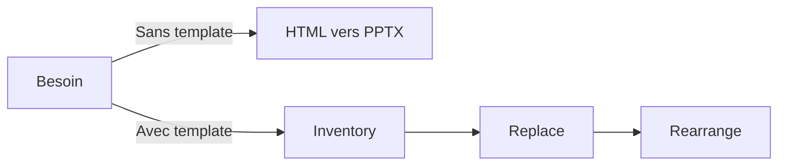

# Presentations PowerPoint (pptx)

Creation et manipulation de presentations PowerPoint (.pptx) avec templates, design avance et generation HTML vers PPTX.

## Contexte

Ce skill permet de creer, modifier et exporter des presentations PowerPoint. Il propose deux workflows : creation libre ou modification de templates existants.

## Cas d'utilisation

- **Creer** des presentations depuis zero
- **Modifier** des presentations existantes avec template
- **Generer** des presentations a partir de HTML
- **Appliquer** un design professionnel (palettes, typographie)
- **Creer des thumbnails** pour apercu visuel

## Deux workflows



- **Sans template** : creation libre a partir de HTML, ideal pour du contenu nouveau.
- **Avec template** : modification d'un fichier existant, ideal pour respecter une charte graphique.

### Sans template (section technique)

```bash
node scripts/html2pptx.js input.html output.pptx
```

### Avec template (section technique)

```bash
python scripts/inventory.py template.pptx
python scripts/replace.py template.pptx out.pptx --data data.json
python scripts/rearrange.py in.pptx out.pptx --order "1,3,2,5"
```

## Design et mise en forme

- **16 palettes de couleurs** predefinies
- **Typographie** adaptee aux presentations professionnelles
- **Layouts** optimises (deux colonnes prefere au stacking)
- **Graphiques et diagrammes** integres

## Commandes utiles (section technique)

| Action | Commande |
|--------|----------|
| **Thumbnails** | `python scripts/thumbnail.py fichier.pptx --cols 4` |
| **Lecture** | `python -m markitdown fichier.pptx` |

## Utilisation

```
@workspace avec pptx, cree une presentation de 10 slides sur [sujet]
@workspace avec pptx, modifie ce template avec les donnees du JSON
@workspace avec pptx, genere des thumbnails de cette presentation
```

## Demarrage rapide

```bash
npx skills add Dedalus-ERP-PAS/foundation-skills --skill pptx -g -y
```

## Ressources

- [SKILL.md complet](../skills/pptx/SKILL.md) — Guide detaille avec palettes et options visuelles
